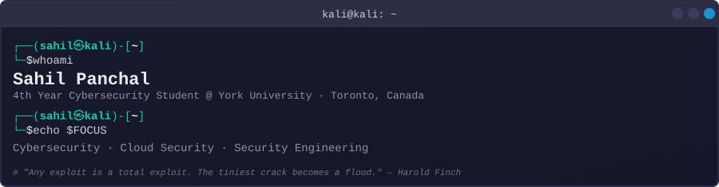

<picture>
  
</picture>

 

## 🛡️ About Me

- 🎓 4th year **BA, Cybersecurity Specialized Honours** at **York University** (Lassonde School of Engineering)
- 🏢 **Software Developer Intern** at Integracheck. Built an automation tool that pushed team throughput from 75% to 130% of benchmark
- 💻 I write Go CLIs, Python pipelines, and Java apps
- 🔴 I build **offensive and defensive security labs**, run the attack chains, and document what broke
- ☁️ Deploy honeypots, SOC pipelines, Sentinel detection rules, and compliance scanners on **Azure** and **AWS**. All **Terraform** and **Bicep**
- 🤖 Red-team LLMs with NVIDIA's garak. Build RAG systems where the search layer enforces access control
- 📜 Studying for **CompTIA Security+** and **Azure Cloud & AI Security Engineer Associate**
- 🏛️ Chair of the **Cybersecurity & Cloud Computing Club** at York University

### 🔗 Connect

---

## 🛠️ Tech Stack

**Languages**

**Cloud & Infrastructure as Code**

**Frameworks & Testing**

**Security & Offensive Tools**

**Platforms & SIEM**

---

## 🔬 Security Labs

| | |
|---|---|
| **[🔴 AD Attack Lab](https://github.com/Panchal-Sahil/Active-Directory-Attack-Lab)**   3-machine AD on KVM via Terraform. Kerberoasting, BloodHound, DCSync, Golden Ticket. 5 findings mapped to MITRE ATT&CK. | **[🍯 Azure Honeypot SOC Lab](https://github.com/Panchal-Sahil/Azure-Honeypot-SOC-Lab)**   Windows 11 honeypot on Azure. 67,841 failed logins from 61 IPs across 11 countries. KQL + Sentinel attack map. Full Bicep IaC. |
| **[🤖 SOC Runbook RAG](https://github.com/Panchal-Sahil/SOC-Analyst-Playbook-RAG)**   RAG app with tier-based access control at the Azure AI Search layer. Restricted docs never reach the model. Flask, Entra ID, Terraform. | **[🔵 Azure Security Lab (IaC)](https://github.com/Panchal-Sahil/Active-Directory-Attack-Lab)**   Phase 2 of the AD lab. Azure Arc, AMA, Sentinel detection rules for Kerberoasting, AS-REP Roasting, DCSync. Terraform with least-privilege RBAC. |

---

## ⚙️ Tools I've Built

| | |
|---|---|
| **[🔍 CloudAudit](https://github.com/Panchal-Sahil/Cloud-Audit)**   Go CLI. 14 read-only AWS checks across 5 CIS Benchmark domains. Severity-weighted scoring, JSON output. Dockerized with GitHub Actions CI. | **[📡 Job-Watch](https://github.com/Panchal-Sahil/Job-Watch)**   Python ETL pipeline. 772 career boards, 23 ATS platforms, one job schema. Per-pod Workday throttling. 149 offline tests. |
| **[🔐 Secrets-Vault-CLI](https://github.com/Panchal-Sahil/Secrets-Vault-CLI)**   Go CLI secrets manager. AES-256-GCM, Argon2id key derivation, PostgreSQL with append-only audit log. | **[👁️ Overlay](https://github.com/Panchal-Sahil/Overlay)**   Electron app. Covers sensitive windows during screen shares without minimizing them. |

---

## 🌍 Open Source Contributions

<table align="center">
<tr>
<td width="120" align="center">
<a href="https://github.com/NVIDIA/garak/issues/1992">
<picture></picture> 
<b>garak</b> · LLM vulnerability scanner
</a>
</td>
<td>
<a href="https://github.com/NVIDIA/garak/issues/1992"><b>Forward generation parameters to Ollama via options dict</b></a> — <b>Merged</b> 
<code>OllamaGenerator</code> dropped generation parameters before every request. Scans ran uncapped. garak recorded truncated payloads as passes. An NVIDIA maintainer reviewed and merged the fix. <b>+176 lines.</b> 
<a href="https://github.com/NVIDIA/garak/issues/1992">Issue #1992</a> · <a href="https://github.com/NVIDIA/garak/pull/1993">PR #1993</a> · <a href="https://github.com/NVIDIA/garak/discussions/2171">Credited in v0.17.0 release</a>
</td>
</tr>
<tr>
<td width="120" align="center">
<a href="https://github.com/Pennyw0rth/NetExec/pull/1409">
<picture></picture> 
<b>NetExec</b> · network execution tool
</a>
</td>
<td>
<a href="https://github.com/Pennyw0rth/NetExec/pull/1409"><b>fix(ldap): handle ranged member attributes in --groups list-all mode</b></a> 
LDAP group enumeration broke on AD groups with 1,500+ members. AD returns ranged attributes past that threshold, and NetExec did not paginate them. 
<a href="https://github.com/Pennyw0rth/NetExec/issues/1405">Issue #1405</a> · <a href="https://github.com/Pennyw0rth/NetExec/pull/1409">PR #1409</a>
</td>
</tr>
</table>

---

## 📊 GitHub Stats

